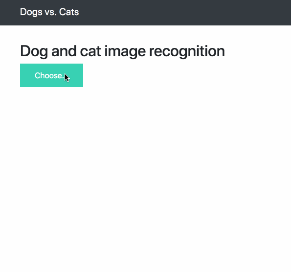

# Dogs vs Cats

## 项目说明

本项目是优达学城的一个毕业项目。项目要求使用深度学习方法识别一张图片是猫还是狗

- 输入：一张彩色图片
- 输出：是猫还是狗

## 项目环境

项目使用Anaconda搭建环境。可是使用environment目录下的yml进行环境安装。

```shell
$ conda env create -f environment.yml
```

## 数据来源

数据集来自 kaggle 上的一个竞赛：[Dogs vs. Cats Redux: Kernels Edition](https://www.kaggle.com/c/dogs-vs-cats-redux-kernels-edition/data)。

下载kaggle猫狗数据集解压后分为 3 个文件 train.zip、 test.zip 和 sample_submission.csv。

train 训练集包含了 25000 张猫狗的图片， 每张图片包含图片本身和图片名。命名规则根据“type.num.jpg”方式命名。

test 测试集包含了 12500 张猫狗的图片， 每张图片命名规则根据“num.jpg”，需要注意的是测试集编号从 1 开始， 而训练集的编号从 0 开始。

sample_submission.csv 需要将最终测试集的测试结果写入.csv 文件中，上传至 kaggle 进行打分。

## 基准模型

项目使用ResNet50, Xception, Inception V3 这三个模型完成。本项目的最低要求是 kaggle Public Leaderboard 前10%。在kaggle上，总共有1314只队伍参加了比赛，所以需要最终的结果排在131位之前，131位的得分是0.06127，所以目标是模型预测结果要小于0.06127。

## 评估指标

kaggle 官方的评估标准是 LogLoss，下面的表达式就是二分类问题的 LogLoss 定义。

<div align="center"><a href="https://www.codecogs.com/eqnedit.php?latex=LogLoss&space;=&space;-\frac{1}{n}\sum_{i=1}^n&space;[y_ilog(\hat{y}_i)&plus;(1-y_i)log(1-&space;\hat{y}_i)]" target="_blank"></a></div>

其中：

- n 是测试集中图片数量

- <a href="https://www.codecogs.com/eqnedit.php?latex=\hat{y}_i" target="_blank"></a> 是图片预测为狗的概率

- <a href="https://www.codecogs.com/eqnedit.php?latex=y_i" target="_blank"></a> 如果图像是狗，则为1，如果是猫，则为0

- <a href="https://www.codecogs.com/eqnedit.php?latex=log()" target="_blank"></a> 是自然（基数 <a href="https://www.codecogs.com/eqnedit.php?latex=e" target="_blank"></a>）对数

对数损失越小，代表模型的性能越好。上述评估指标可用于评估该项目的解决方案以及基准模型。

## 设计大纲

```shell
$ cd model_graphviz/
$ make
```


整个模型是在本地训练的，训练了三天才完成。建议使用云端 GPU 训练复现实验过程。

**1. 数据预处理**

- 从kaggle下载好图片
- 将猫和狗的图片放在不同的文件夹以示分类，使用创建符号链接的方法
- 对图片进行resize，保持输入图片信息大小一致

**2. 模型搭建**

Kera的应用模块Application提供了带有预训练权重的Keras模型，这些模型可以用来进行预测、特征提取和微调整和。

- Xception 默认输入图片大小是 `299*299*3`
- InceptionV3 默认输入图片大小是 `299*299*3`
- ResNet50 默认输入图片大小是 `224*224*3`

在Keras中载入模型并进行全局平均池化，只需要在载入模型的时候，设置`include_top=False`, `pooling='avg'`. 每个模型都将图片处理成一个` 1*2048 `的行向量，将这三个行向量进行拼接，得到一个` 1*6144 `的行向量， 作为数据预处理的结果。

**3. 模型训练&模型调参**

载入预处理的数据之后，先进行一次概率为0.5的dropout，然后直接连接输出层，激活函数为Sigmoid，优化器为Adam，输出一个零维张量，表示某张图片中有狗的概率。

**4. 模型评估**

- 使用$Logloss$进行模型评估,上传Kaggle判断是否符合标准

**5. 可视化**

- 进行数据探索并且可视化原始数据
- 可视化模型训练过程的准确率曲线，损失函数曲线等

## 项目部署

项目使用 Keras 和 Flask 搭建部署一个简单易用的深度学习图像网页应用，可以通过网页导入一张彩色猫或者狗的图片预测是猫或者狗的概率。

项目目录结构：

```python
.
├── README.md
├── ResNet50_image_predict.ipynb
├── app.py
├── environmert.yml
├── static
│   ├── css
│   │   └── main.css
│   └── js
│       └── main.js
├── templates
│   ├── base.html
│   └── index.html
├── models
│   └── ResNet50_catdog_model.h5
├── uploads
│   ├── test01.jpg
│   └── test02.jpg
└── webapp_image_predict.ipynb
```

### 环境搭建

```shell
$ conda env create -f environmert.yml
```

### 运行

```shell
$ python app.py
```

这时候用浏览器打开 <http://localhost:5000/> 就可以进行网页导入图片预测图片是狗的概率了。

### 快速复现webapp预测结果

如果不想搭建环境复现实验结果，可以按照以下操作分分钟复现实验结果：

```shell
$ docker pull miaowmiaow/webapp:1.1.0
$ docker run -p 5000:5000 miaowmiaow/webapp:1.1.0
```

到此就可以在浏览器中输入 [http://localhost:5000](http://localhost:5000) 就可以使用网页对导入的猫狗图片做预测了。

下图为预测的效果图：


