# 机器学习纳米学位毕业项目 -- 猫狗大战

苗沛

2018.09.15

## I. 问题的定义
### 项目概述

本项目来源于 kaggle 竞赛项目， 最终目的是训练一个机器学习模型， 输入一张图片来分辨图像中的猫和狗，也可是猫或狗的面部坐标甚至是身体的一部分。是一个典型的图像二分类问题。

本项目使用的卷积神经网络(Convolutional Neural Network, CNN)，卷积神经网络是深度学习技术中极具代表的网络结构之一，在图像处理领域取得了很大的成功，在国际标准的 ImageNet 数据集上，许多成功的模型都是基于 CNN 的。CNN 相较于传统的图像处理算法的优点之一在于，避免了对图像复杂的前期预处理过程（提取人工特征等），可以直接输入原始图像。CNN 网络对图片进行多次卷基层和池化层处理，在输出层给出两个节点并进行 softmax 计算得到两个类别各自的概率。

本项目最终需要训练基于 CNN 的机器学习模型，对测试样本进行分类，并将最终结果上传 kaggle 进行最终评判。

本项目同时也实现了使用 Keras 和 Flask 搭建部署一个简单易用的深度学习图像网页应用，可以通过网页导入一张彩色猫或者狗的图片预测是猫或者狗的概率。

### 问题称述

- 数据集中大部分图片是正常的，有少部分异常图片和低分辨率图片，对于训练集来说这些异常数据是要剔除掉的。

- 数据集中的文件名是以 type.num.jpg 方式命名的，比如 cat.0.jpg。使用 Keras 的 ImageDataGenerator 需要将不同种类的图片分在不同的文件夹中。

- 数据集中的图像大小是不固定的，但是神经网络输入节点的个数是固定的。所以在将图像的像素作为输入之前，需要将图像的大小进行 resize。

### 评价指标

对数损失（Log loss）亦被称为逻辑回归损失（Logistic regression loss）或交叉熵损失（Cross-entropy loss）。 交叉熵是常用的评价方式之一，它实际上刻画的是两个概率分布之间的距离，是分类问题中使用广泛的一种损失函数。

本文实际上是二分类问题， 因此可以采用 logloss 损失函数作为评价指标， 计算公式如下：

$$ LogLoss = -\frac{1}{n}\sum_{i=1}^n [y_ilog(\hat{y}_i)+(1-y_i)log(1- \hat{y}_i)]$$

其中：

- n 是测试集中图片数量
- $\hat{y}_i$ 是图片预测为狗的概率
- $y_i$ 如果图像是狗，则为1，如果是猫，则为0
- $log()$ 是自然（基数 $e$）对数

采用交叉熵作为损失函数可以有效的解决梯度消失和梯度爆炸的问题。

交叉熵损失越小，代表模型的性能越好。上述评估指标可用于评估该项目的解决方案以及基准模型。

## II. 分析

### 数据的探索

下载 kaggle 猫狗数据集解压后分为 3 个文件 train.zip、 test.zip 和 sample_submission.csv。

train 训练集包含了 25000 张猫狗的图片，猫狗各一半，每张图片包含图片本身和图片名。命名规则根据 “type.num.jpg” 方式命名。

test 测试集包含了 12500 张猫狗的图片，没有标定是猫还是狗，每张图片命名规则根据 “num.jpg”，需要注意的是测试集编号从 1 开始，而训练集的编号从 0 开始。

sample_submission.csv 需要将最终测试集的测试结果写入.csv 文件中，上传至 kaggle 进行打分。

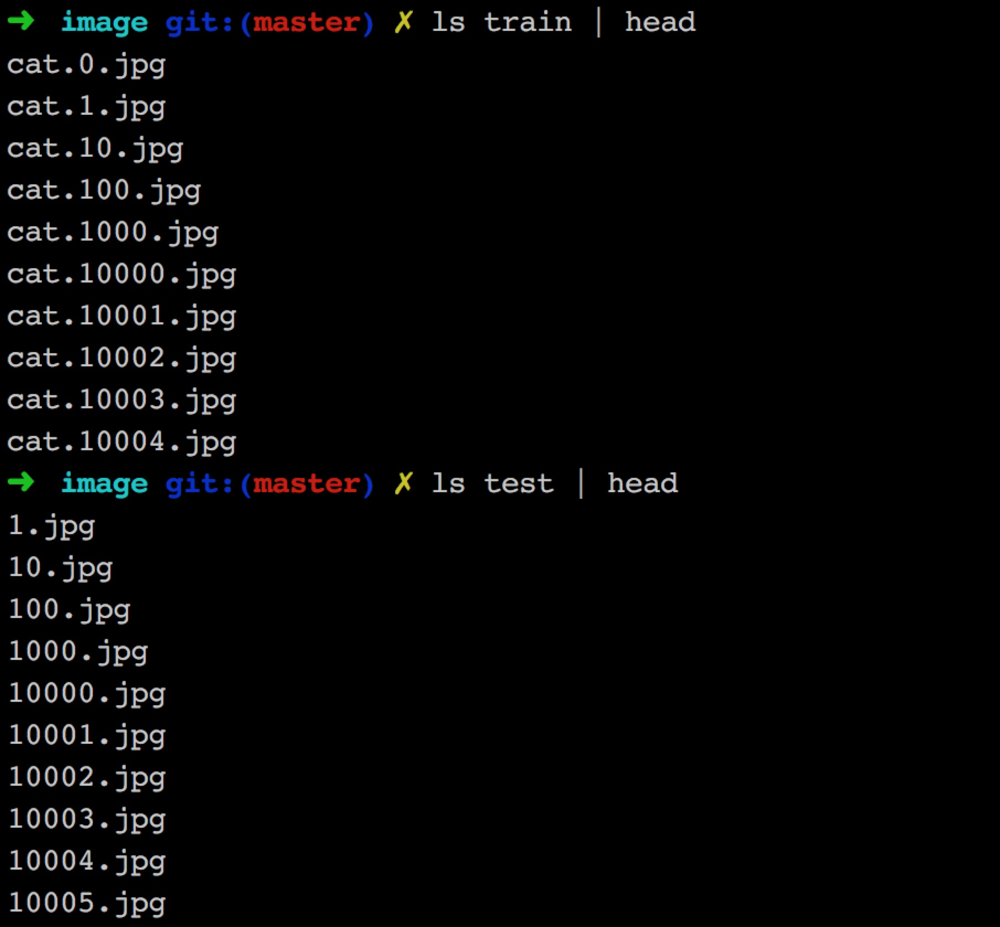

从训练集中随机提取图片可视化如下：

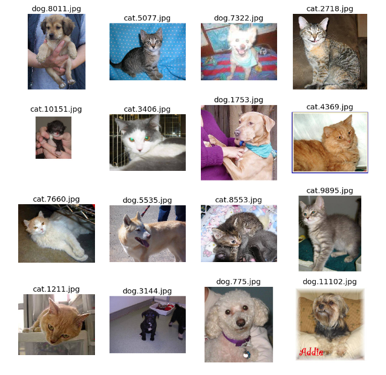

训练集中图片的尺寸散点分布图:


测试集中图片的尺寸散点分布图：

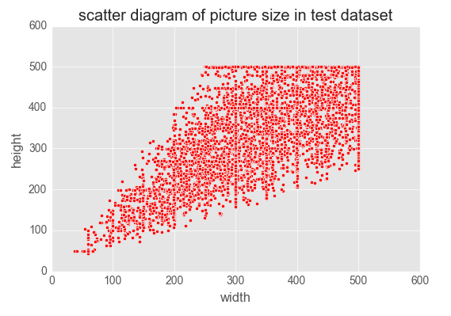

通过对图片中的色彩-像素比进行 IQR 分析，可以发现很多分辨率低、无关的图片，下面是其中一些不合格的图片：


经过观察数据，数据集中大部分图片是正常的，有少部分异常图片，对于训练集来说这些异常数据是要剔除掉的。

### 算法和技术

#### 问题分析

在给定一张图片，系统需要预测出图像属于预先定义类别中的哪一类。在计算机视觉领域，目前解决这类问题的核心技术框架是深度学习（Deep Learning），特别地，针对图像类型的数据，是深度学习中的卷积神经网络（Convolutional Neural Networks, ConvNets）架构。常见的卷积神经网络架构如下：

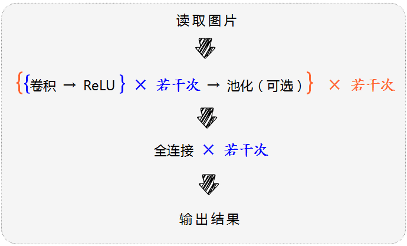

卷积神经网络中卷积层和池化层主要是对图片的几何特征进行抽取，比如浅层的卷积池化层可以抽取出一些直线，角点等简单的抽象信息，深层的卷积池化层可以抽取人脸等复杂的抽象信息，最后的全连接层才是对图片分类的关键处理。

因此可以利用已经训练好的卷积神经网络提取图片中复杂的几何特征，即将原始图片用已经训练好的卷积神经网络处理之后的输出，作为新的输入，然后加上自己的全连接层，去进行分类。在模型训练的过程中，只改变新加的全连接层的权重。

总的来说，卷积神经网络是一种特殊的神经网络结构，即通过卷积操作可以实现对图像特征的自动学习，选取那些有用的视觉特征以最大化图像分类的准确率。

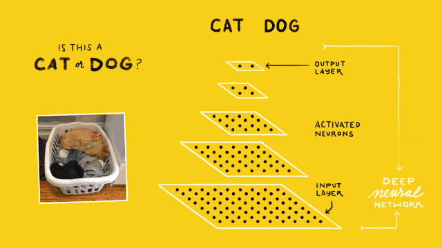

上图给出了一个简单的猫狗识别的卷积神经网络结构，在最底下（同时也是最大的）的点块表示的是网络的输入层（Input Layer），通常这一层作用是读入图像作为网络的数据输入。在最上面的点块是网络的输出层（Output Layer），其作用是预测并输出读入图像的类别，在这里由于只需要区分猫和狗，因此输出层只有 2 个神经计算单元。而位于输入和输出层的，都称之为隐含层（Hidden Layer），图中有 3 个隐含层，图像分类的隐含层都是由卷积操作完成的，因此这样的隐含层也成为卷积层（Convolutional Layer）。因此，输入层、卷积层、输出层的结构及其对应的参数就构成了一个典型的卷积神经网络。

当然，在实际中使用的卷积神经网络要比这个示例的结构更加复杂，自 2012 年的 ImageNet 比赛起，几乎每一年都会有新的网络结构诞生，已经被大家认可的常见网络有 AlexNet, VGG-Net, GoogLeNet, Inception V2-V4, ResNet 等等。这些卷积神经网络都是在 ImageNet 数据集上表现非常优异的神经网络，具体准确率和模型大小如下图所示。


#### 模型选择及技术

由于每一种神经网络提取的特征都不一样，因此本项目将多个神经网络处理的结果拼接，作为最后一层全连接层的输入，这样做可以有效地降低方差。

本项目迁移学习部分使用 Keras 实现，而 Keras 中可以导入的模型有 Xception，VGG16，VGG19，ResNet50，InceptionV3，InceptionResNet -V2，MobileNet. 综合考虑模型的分类准确率和大小，选用迁移学习的基础模型为 ResNet50，InceptionV3 和 Xception。

卷积神经网络结构演化图：


**ResNet：**

ResNet引入了残差网络结构（residual network），通过这种残差网络结构，可以把网络层弄的很深（据说目前可以达到 1000 多层），并且最终的分类效果也非常好，残差网络的基本结构如下图所示，很明显，该图是带有跳跃结构的：

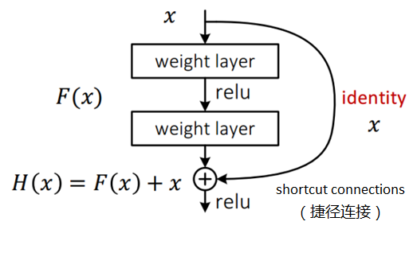

残差网络借鉴了高速网络（Highway Network）的跨层链接思想，但对其进行改进（残差项原本是带权值的，但 ResNet 用恒等映射代替之）。

假定某段神经网络的输入是 $x$，期望输出是 $H(x)$，即 $H(x)$ 是期望的复杂潜在映射，如果是要学习这样的模型，则训练难度会比较大；回想前面的假设，如果已经学习到较饱和的准确率（或者当发现下层的误差变大时），那么接下来的学习目标就转变为恒等映射的学习，也就是使输入 $x$ 近似于输出 $H(x)$，以保持在后面的层次中不会造成精度下降。

在上图的残差网络结构图中，通过“shortcut connections（捷径连接）”的方式，直接把输入$x$传到输出作为初始结果，输出结果为 $H(x)=F(x)+x$，当 $F(x)=0$ 时，那么 $H(x)=x$，也就是上面所提到的恒等映射。于是，ResNet 相当于将学习目标改变了，不再是学习一个完整的输出，而是目标值 $H(X)$ 和 $x$ 的差值，也就是所谓的残差 $F(x) := H(x)-x$，因此，后面的训练目标就是要将残差结果逼近于 $0$，使到随着网络加深，准确率不下降。

这种残差跳跃式的结构，打破了传统的神经网络 $n-1$ 层的输出只能给 $n$ 层作为输入的惯例，使某一层的输出可以直接跨过几层作为后面某一层的输入，其意义在于为叠加多层网络而使得整个学习模型的错误率不降反升的难题提供了新的方向。

在此之前，深度神经网络常常会有梯度消失问题的困扰，即来自误差函数的梯度信号会在反向传播回更早的层时指数级地下降。本质上讲，在误差信号反向回到更早的层时，它们会变得非常小以至于网络无法学习。但是，因为 ResNet 的梯度信号可以直接通过捷径连接回到更早的层，所以一下子就可以构建 50 层、101 层、152 层甚至 1000 层以上的网络了，而且它们的表现依然良好。那时候，这在当时最佳的基础上实现了巨大的飞跃——这个 22 层的网络赢得了 ILSVRC 2014 挑战赛。

**Inception V3：**

Inception 模块之间特征图的缩小，主要有下面两种方式：


右图是先进行 Inception 操作，再进行池化来下采样，但是这样参数量明显多于左图(比较方式同前文的降维后 Inception 模块)，因此 v2 采用的是左图的方式，即在不同的 Inception 之间（35/17/8 的梯度）采用池化来进行下采样。

但是，左图这种操作会造成表达瓶颈问题，也就是说特征图的大小不应该出现急剧的衰减(只经过一层就骤降)。如果出现急剧缩减，将会丢失大量的信息，对模型的训练造成困难。

因此，在2015年12月提出的 Inception V3结构借鉴 Inception 的结构设计了采用一种并行的降维结构，如下图：


经过优化后的inception v3网络与其他网络识别误差率对比如表所示：

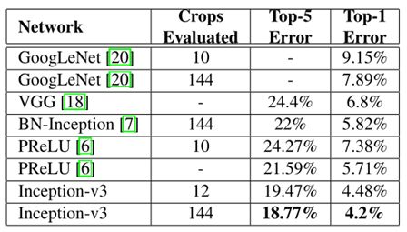

Inception V3 一个最重要的改进是分解（Factorization），将 $7x7$ 分解成两个一维的卷积$（1x7,7x1）$，$3x3$ 也是一样$（1x3,3x1）$，这样的好处，既可以加速计算，又可以将 1 个卷积拆成 2 个卷积，使得网络深度进一步增加，增加了网络的非线性（每增加一层都要进行 ReLU）。
另外，网络输入从 $224*224$ 变为了 $299*299$。

**Xception：**

Xception 实际上采用了类似于 ResNet 的网络结构，主体部分采用了模块化设计。如下图所示：


Xception 是 google 继 Inception 后提出的对 Inception v3 的另一种改进，主要是采用 depthwise separable convolution 来替换原来Inception v3中的卷积操作。

Xception 取名的由来是 "Extreme Inception"，Inception V3 的演进过程：


"极端形式"同 SeparableConv 的区别主要有两点：

- $3x3$ 卷积和 $1x1$ 卷积的先后顺序。 原来的 Inception 结构是先 $1x1$ 卷积，后 $3x3$ 卷积。作者认为这里的区别并不重要。

- 两个卷积层之间是否有激活函数。 原来的 Inception 中间是有 ReLU 激活的。 但实验结果证明不加激活效果更好。

### 基准模型

本项目的最低要求是 kaggle Public Leaderboard 前 10%。在 kaggle 上，总共有 1314 只队伍参加了比赛，所以需要最终的结果排在 131 位之前，131 位的得分是 0.06127，所以目标是模型预测结果要小于 0.06127。

## III. 方法

### 数据预处理

对于异常数据的清理采用 [优达学习笔记](https://zhuanlan.zhihu.com/youdanote) 提供的“预处理模型”方法实现异常数据清洗。

评价 ImageNet 有指标 Top-1 和 Top-5： 

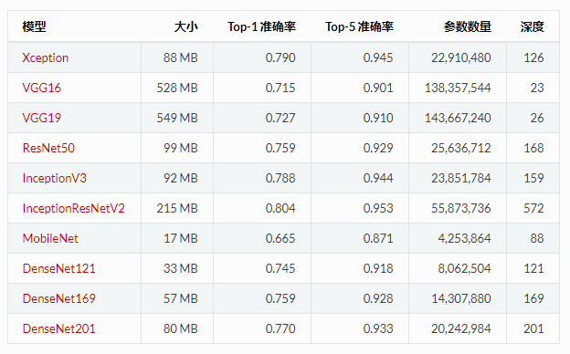

本项目使用 InceptionV3 top-10 训练train训练集。训练过程中将图片的名称和预测 top-10 的结果保存到字典里，训练结束后保存字典为 `train_decode_predictions.csv`。将模型预测结果与 `ImageNetClasses.csv` 进行异常数据排查。具体实现代码参考 `outlier_detection.ipynb` 。

使用 InceptionV3 模型排查出的异常图片总数为：131张，其中有些图片是正常的，经过筛选后选出 43 张异常图片作为本试验要清理的异常图片。这些异常图片如下图：


去除异常数据后数据分布如下：

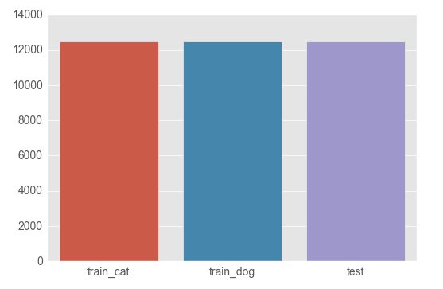

数据集清洗后，猫的数量：12482，狗的数量：12475，测试集图片数量：12500。

由于我们的数据集的文件名是以 type.num.jpg 这样的方式命名的，比如 cat.0.jpg，但是使用 Keras 的 `ImageDataGenerator` 需要将不同种类的图片分在不同的文件夹中，因此我们需要对数据集进行预处理。这里我们采取的思路是创建符号链接(symbol link)，这样的好处是不用复制一遍图片，占用不必要的空间。

文件目录结构如下：

```python
image/
├── test 
├── img_test
│   ├── test -> ../test/
├── train 
├── img_train
│   ├── cat 
│   └── dog 
```

### 执行过程

#### 生成迁移学习特征向量

Xception，InceptionV3 和 ResNet50 这三个模型对于输入数据都有各自的默认值，比如在输入图片大小维度上，Xception 和 InceptionV3 默认输入图片大小是 $299*299$，ResNet50 默认输入图片大小是 $224*224$；在输入数值维度上，Xception 和 InceptionV3 默认输入数值在 (-1, 1) 范围内。当要输入与默认图片大小不同的图片时，只需传入当前图片大小即可。ResNet50 需要对图片进行中心化处理，由于载入的 ResNet50 模型是在 ImageNet 数据上训练出来的，所以在预处理中每个像素点都要减去 ImageNet 均值。当要输入与默认图片大小不同的图片时，只需传入当前图片大小即可。当输入数值不符合默认要求时，使用每个模型的预处理函数 `preprocess_input` 即可将输入图片处理成该模型的标准输入。

常见的卷积神经网络结构在前面的若干层都是卷积池化层及其各种变种，后面几层都是全连接层，这些全连接层之前的网络层被称为瓶颈层 (bottleneck). 将新的图片通过训练好的卷积神经网络直到瓶颈层的过程可以看做是对图像进行特征提取的过程。一般情况下，为了减少内存的消耗， 加快计算的过程，再将瓶颈层的结果输入全连接层之前，做一次全局平均 池化，比如 ResNet50 瓶颈层输出结果是 $7*7*2048$，如果直接输入到全连接层，参数会非常多，所以进行一次全局平均池化，将输出矩阵调整为 $1*1*2048$，这么做还有一个好处，那就是可以降低过拟合的程度。

在 Keras 中载入模型并进行全局平均池化，只需要在载入模型的时候，设置 `include_top=False`, `pooling='avg'`. 每个模型都将图片处理成一个  $1*2048$ 的行向量，将这三个行向量进行拼接，得到一个 $1*6144$ 的行向量，作为数据预处理的结果。

```python
def write_gap(MODEL, image_size, lambda_func=None):
    width = image_size[0]
    height = image_size[1]
    input_tensor = Input((height, width, 3))
    x = input_tensor
    if lambda_func:
        x = Lambda(lambda_func)(x)
    
    base_model = MODEL(input_tensor=x, weights='imagenet', include_top=False, pooling='avg')
    model = Model(base_model.input, GlobalAveragePooling2D()(base_model.output))
    
    gen = ImageDataGenerator()
    train_generator = gen.flow_from_directory("img_train", image_size, shuffle=False, 
                                              batch_size=16)
    test_generator = gen.flow_from_directory("img_test", image_size, shuffle=False, 
                                             batch_size=16, class_mode=None)

    train = model.predict_generator(train_generator, train_generator.nb_sample)
    test = model.predict_generator(test_generator, test_generator.nb_sample)

    with h5py.File("gap_%s.h5"%MODEL.__name__) as h:
        h.create_dataset("train", data=train)
        h.create_dataset("test", data=test)
        h.create_dataset("label", data=train_generator.classes)
```

#### 载入特征向量

经过上面的代码以后，我们获得了三个特征向量文件，分别是：

- gap_ResNet50.h5
- gap_InceptionV3.h5
- gap_Xception.h5

这里需要载入这些特征向量，并且将它们合成一条特征向量，然后记得把 X 和 y 打乱，不然之后设置 `validation_split` 的时候会出问题。这里设置了 numpy 的随机数种子为 2018。

```python
np.random.seed(2018)

X_train = []
X_test = []

for filename in ["gap_ResNet50.h5", "gap_Xception.h5", "gap_InceptionV3.h5"]:
    with h5py.File(filename, 'r') as h:
        X_train.append(np.array(h['train']))
        X_test.append(np.array(h['test']))
        y_train = np.array(h['label'])

X_train = np.concatenate(X_train, axis=1)
X_test = np.concatenate(X_test, axis=1)

X_train, y_train = shuffle(X_train, y_train)
```

#### 构建模型

载入预处理的数据之后，先进行一次概率为 0.5 的 dropout，然后直接连接输出层，激活函数为 Sigmoid，优化器为 Adadelta，输出一个零维张量，表示某张图片中有狗的概率。

```python
input_tensor = Input(X_train.shape[1:])
x = input_tensor
x = Dropout(0.5)(x)
x = Dense(1, activation='sigmoid')(x)
model = Model(input_tensor, x)

model.compile(optimizer='adadelta',
              loss='binary_crossentropy',
              metrics=['accuracy'])
```

整个迁移学习的神经网格结构如下所示:

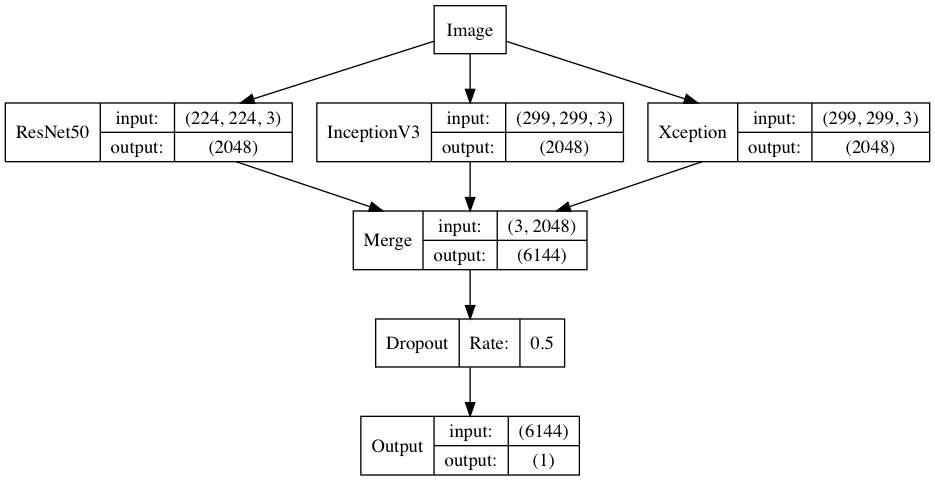

#### 训练模型

模型构件好了以后，我们就可以进行训练了，这里我们设置验证集大小为 20% ，也就是说训练集是 19964 张图，验证集是 4991 张图。

```python
model_history = model.fit(X_train, 
                    y_train,
                    batch_size=128,
                    nb_epoch=8,
                    verbose=1,
                    validation_split=0.2,
                    callbacks = [TensorBoard(log_dir='./Graph')])

model.save('model.h5')
```

保存模型为：model.h5

### 完善

- 本项目通过对图片中的色彩-像素比进行 IQR 分析，经人工筛选后剔除了分辨率低、无关的图片，这种方法并不能把所有的异常图片都剔除掉。比如还有一些图片被别的物体遮挡，对训练造成干扰等等。后期可以考虑多方面对图片做筛选处理

- 图片中猫狗的拍摄角度不尽相同，而且猫狗占整张图片的比例也有所差别。为了让模型尽量不受这些因素的干扰，增强模型的泛化能力，需要对原始图片进行一些随机操作，比如旋转、剪切变换、缩放、水平翻转等。Keras 提供的图片生成器 `ImageDataGenerator` 可以很方便地对图片进行提升

- 对模型参数的优化，通过不同的优化器的尝试得到更好的优化结果

## IV. 结果

### 模型的评价与验证


我们可以看到，训练的过程很快，十秒以内就能训练完，准确率也很高，在验证集上最高达到了99.4%的准确率，这相当于一千张图只错了6张，可以说比我还厉害。

训练过中的 loss 和 accuracy 如下：


将测试集的处理结果提交到kaggle上，loss为0.04150，和验证集的loss近似。

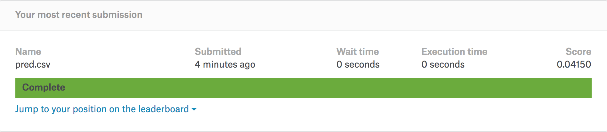

### 合理性分析

单个 ResNet50 模型 5 次迭代训练结果：

- 训练集loss：0.0755，验证集loss：0.0419。

使用 Xception，InceptionV3 和 ResNet50 这三个模型进行迁移学习 5 次迭代训练结果：

- 训练集loss：0.0152，验证集loss：0.0170。

原始的 Xception 有 126 层，原始的 InceptionV3 有 159 层，原始的 ResNet50 有 168 层，更多的层数，不同的卷积核各种各样的的组合，可以更好的抽取图片中的泛化特征，这样既可以提高分类的准确率，又可以降低模型的过拟合风险，所以现在在各种比赛中斩头露角的神经网络层数都非常的多，深度很深，这也是类似的神经网络被称为深度学习的一个主要原因。

Xception，InceptionV3 和 ResNet50 这三个模型进行组合迁移学习，效果比先单个神经网络模型效果好。这里利用了 bagging 的思想，通过多个模型处理数据并进行组合，可以有效降低模型的方差，减少过拟合程度，提高分类准确率。

## V. 项目结论

### 结果可视化

下图是使用优化之前的 ResNet50 模型进行预测的结果展示，可以看到都是正确的结果，只是精度达不到项目要求。使用了知乎上优达学城官方方法进行了实现，完全能达到项目的要求。

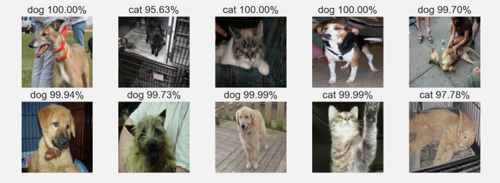

### 对项目的思考

深度学习毫无疑问是处理图像问题最佳的机器模型，近年来各大赛的前几名均是通过深度学习获取了前几名的好成绩。但是相比于传统的机器学习模型，深度学习需要更多的数据，更强大的算力和资源。本项目在训练迁移学习模型使用的是自己的 Mac，足足跑了三天训练完，泪崩。建议在使用的时候用云计算平台去训练。

kaggle 上猫狗大战前几名的 loss 达到了 0.0330，相比于本文中的 0.0415，绝对值减少了 0.0085，说明还是有较大的改进空间。本文只是使用的 Xception，InceptionV3 和 ResNet50 这三个模型进行了提取特征向量，然后将特征向量直接拼接，忽略了特征之间的位置关系。除了这三个模型，还可以增加更多新的模型，或者使用stacking的方法进行模型融合，进一步降低方差，提高分类的准确率。还可以从原始样本上入手，有些图片的分类概率正确，但是不够确定，可以先做一部分处理，然后让模型更加确定。

### 需要作出的改进

相比 Keras，TensorFlow 真的真的太麻烦了，但是 Google 为什么要把 TensorFlow 做的这么麻烦呢？个人认为是为了运行的高效率和极大的灵活性做出了让步。TensorFlow 是经过工业界实际产品考验过的框架，生态及其丰富，想实现一个功能，有多种写法，学起来有一种 C++ 的感觉，Keras 更像是为了快速出活的框架，如果想做一些改动十分的麻烦，Keras 的默认 backend 就是 TensorFlow，所以 Keras 的执行效率是比 TensorFlow 慢很多的。TensorFlow1.4 里面已经把 `tf.contrib.keras` 更改为核心模块 `tf.keras`，所以 TensorFlow 以后用起来应该也会方便很多。最后还想说的是 PyTorch，好多人都推荐，说不仅仅有 TensorFlow 的高效率，而且很 pythonic，可以在任意层和 numpy 数组进行转化。

## VI. 参考文献

[1] K. He, X. Zhang, S. Ren, and J. Sun. Deep residual learning for image recognition. arXiv preprint arXiv:1512.03385, 2015.

[2] Christian Szegedy, Wei Liu, Yangqing Jia. Going Deeper with Convolutions arXiv:1409.4842, 2014

[3] François Chollet. Xception: Deep Learning with Depthwise Separable Convolutions arXiv:1610.02357, 2016

[4][手把手教你如何在Kaggle猫狗大战冲到Top2%](https://zhuanlan.zhihu.com/p/25978105)

[5] Karen Simonyan and Andrew Zisserman. VERY DEEP CONVOLUTIONAL NETWORKS FOR LARGE- SCALE IMAGE RECOGNITION. At ICLR,2015.

[6] K. Simonyan and A. Zisserman. Very deep convolutional networks for large-scale image recognition. In ICLR, 2015.

[7] [Building powerful image classification models using very little data.](https://blog.keras.io/building-powerful-image-classification-models-using-very-little-data.html)

[8] [Dogs vs. Cats: Image Classification with Deep Learning using TensorFlow in Python.]( https://www.datasciencecentral.com/profiles/blogs/dogs-vs-cats-image-classification-with-deep-learning-using)

[9] [ImageNet: VGGNet, ResNet, Inception, and Xception with Keras.](https://www.pyimagesearch.com/2017/03/20/imagenet-vggnet-resnet-inception-xception-keras/)

[10] The residual module in ResNet as originally proposed by He et al. in 2015. 

[11] An Analysis of Deep Neural Network Models for Practical Applications. arXiv:1605.07678, 2017.
