# 机器学习纳米学位——猫狗大战

张嘉
2018-04-17

## 1 定义

### 1.1 项目概览

猫狗大战（Dogs Vs. Cats）项本次项目是kaggle上的一个竞赛题目，目标是训练一个模型从给定的图片中分辨出是猫还是狗，这个是计算机视觉领域的一个问题，也是一个二分类问题。猫狗是我们日常生活中最常见两种动物，所以日常生活中也必然会留下非常多的照片，这位我们提供了良好的训练数据。

本项目中使用的模型是卷积神经网络（Convolutional Neural Network, CNN）是一种前馈神经网络，它的人工神经元可以响应一部分覆盖范围内的周围单元，对于大型图像处理有出色表现。

项目选择的数据集是Kaggle上竞赛提供的数据，训练集包括12500张被标记为猫和12500标记为猫的图片。测试机是包含12500未标记的图片。对于每一张测试机中的图像，模型需要预测出是狗图像的概率（1 代表狗，0 代表猫）。Kaggel中也有很多有很多人对这个项目提供了不一样的方法，对我有一定的参考作用。

在这个项目中我会建立一个神经网络分类器来对猫狗的照片进行分类。

### 1.2 问题说明

项目需要识别出猫狗，本质上是二分类问题。对应于监督学习就是使用现有的标签的图片训练模型，完成训练后对没有标签的图片进行分类。因此也可以使用监督学习方法如SVM解决此问题。项目要求使用深度学习方法识别一张图片是猫还是狗，通过训练模型，任意一张测试的图片，模型总能将输入数据映射为是猫或者狗的概率。

整个处理过程大概如下:

##### 数据预处理
* 从kaggle下载好图片
* 为keras.ImageDataGenerator准备数据，要求猫和狗在不同的文件夹以示分类
* 对图片进行resize，保持输入图片信息大小一致
* 对训练数据进行随机偏移、转动等变换图像处理，这样可以尽可能让训练数据多样化

##### 模型搭建
Kera的应用模块Application提供了带有预训练权重的Keras模型，这些模型可以用来进行预测、特征提取和微调整和。

* 使用ResNet50等现有的去掉了全连接层预训练模型
* 添加自己的全连接层到ResNet50网络

##### 模型训练&模型调参

* 导入预训练的网络权重
* 冻结除了全连接成的所有层，获得bottleneck特征 
* 尝试使用不同的优化器 adam,adadelta等对模型进行训练，选择最佳模型


### 1.3 指标
在kaggle的比赛中提出了标准的评价公式，采用对数损失来衡量
公式如下：

$$ LogLoss = -\frac{1}{n}\sum_{i=1}^n [y_ilog(\hat{y}_i)+(1-y_i)log(1- \hat{y}_i)]$$
其中：

* $n$ 是图片数量
* $\hat{y}_i$是模型预测为狗的概率
* $y_i$是类别标签，1 对应狗，0 对应猫
* $log()$ 表示自然对数

对数损失越小，代表模型的性能越好。上述评估指标可用于评估该项目的解决方案以及基准模型。

<br><br><br><br><br><br>
## 2 分析
### 2.1 探索性可视化
从kaggle下载的数据集中包含了两个文件，`test.zip` and `train.zip`。`train.zip`里面包含了12500猫的照片和12500张狗的照片,每张照片的文件名中都包含有dog或者cat的标签。`test.zip`里有有12500张照片，文件名中没有标签。

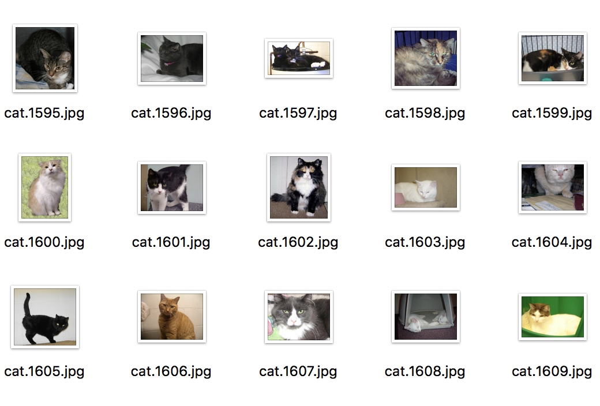


上图是训练集的照片都，是日常生活中的随手拍的照片。拍摄手法随意，而且图片的背景非常的生活化。

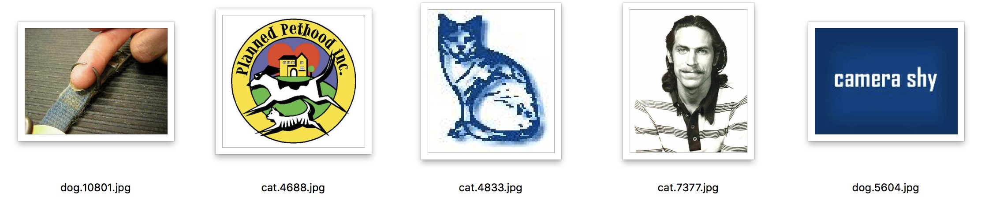
而且在训练集中存在很多很抽象或者根本就是错误的标签照片，对我的程序形成很大的干扰。

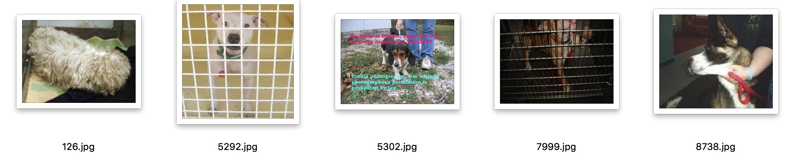
在测试集中同样会有些效果比较差。如126,没有动物的面部图像，就是人类也不能直接从照片中看出是猫还是狗，5292和7999都是有网格阻挡，而5302照片中会有一些多余的文字信息。这些都是对我的图像分类器形成相当大的挑战。


数据集中 `image/train/`里的猫狗没有分类，放在一个文件夹，因为需要使用keras，需要将训练照片按照类别文件夹分类，其中猫放在一个文件夹，狗放在一个文件夹img_train 里面包含两个文件夹，一个是cat，一个是dog


``` python 
├── image
│   ├── img_test 
│   │   └── test  [12500zhang]
│   ├── img_train [合计20000张]
│   │   ├── cat
│   │   └── dog
│   ├── img_valid [合计5000张]
│   │   ├── cat
│   │   └── dog
```


| 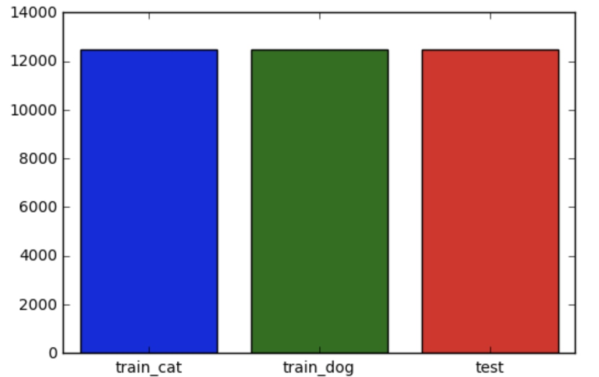| 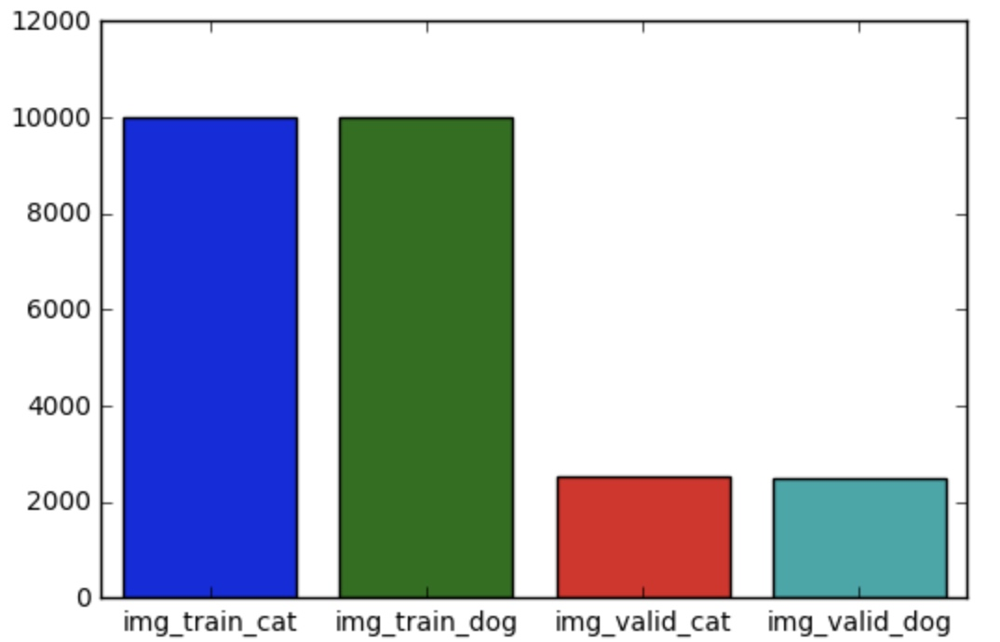 | 
| :---: |:---:|
| 原始数据集 | 划分训练集验证集的数据集 | 


### 2.2 算法与方法
#### 2.2.1 深度学习&神经网络简介

**深度学习（deep learning）**是机器学习的分支.深度学习的概念源于人工神经网络的研究。含多隐层的多层感知器就是一种深度学习结构。深度学习通过组合低层特征形成更加抽象的高层表示属性类别或特征，以发现数据的分布式特征表示。

深度学习的概念由Hinton等人于2006年提出。基于深度置信网络(DBN)提出非监督贪心逐层训练算法，为解决深层结构相关的优化难题带来希望，随后提出多层自动编码器深层结构。此外Lecun等人提出的卷积神经网络是第一个真正多层结构学习算法，它利用空间相对关系减少参数数目以提高训练性能。

深度学习是机器学习中一种基于对数据进行表征学习的方法。观测值（例如一幅图像）可以使用多种方式来表示，如每个像素强度值的向量，或者更抽象地表示成一系列边、特定形状的区域等。而使用某些特定的表示方法更容易从实例中学习任务（例如，人脸识别或面部表情识别）。深度学习的好处是用非监督式或半监督式的特征学习和分层特征提取高效算法来替代手工获取特征。

**人工神经网络（Artificial Neural Network，即ANN ）**，是20世纪80 年代以来人工智能领域兴起的研究热点。它从信息处理角度对人脑神经元网络进行抽象， 建立某种简单模型，按不同的连接方式组成不同的网络。在工程与学术界也常直接简称为神经网络或类神经网络。神经网络是一种运算模型，由大量的节点（或称神经元）之间相互联接构成。每个节点代表一种特定的输出函数，称为激励函数（activation function）。每两个节点间的连接都代表一个对于通过该连接信号的加权值，称之为权重，这相当于人工神经网络的记忆。网络的输出则依网络的连接方式，权重值和激励函数的不同而不同。而网络自身通常都是对自然界某种算法或者函数的逼近，也可能是对一种逻辑策略的表达。
最近十多年来，人工神经网络的研究工作不断深入，已经取得了很大的进展，其在模式识别、智能机器人、自动控制、预测估计、生物、医学、经济等领域已成功地解决了许多现代计算机难以解决的实际问题，表现出了良好的智能特性。


神经网络是由神经元构成的。神经元的结构如下图，在人工神经网络中也叫做感知机。
<div align = center>
 
感知机结构图

</div>

一个感知机包含如下部分：
输入权值（inputs），一个感知机可以接受多个输入$(x_1,x_2,x_3,...,x_n,\forall	 X_{i \in R})$在每个输入上又一个权值$w_{i \in R}$，此外还有一个偏置项 $b \in R$,也就是上图的激活函数感知器的激活函数可以有很多选择，比如我们可以选择下面的阶跃函数$f(x)$ 来作为激活函数：

$$f(x) = \begin{cases} 1,x>0 \\ 0,x\leq0 \\  \end{cases} $$
		
输出，感知机的输出有如下公式来计算：

$$ y=f(w*x+b)$$
	
深度学习使用的是神经网络模型，神经网络其实是按照一定规则连接起来的多个神经元。
<div align = center>
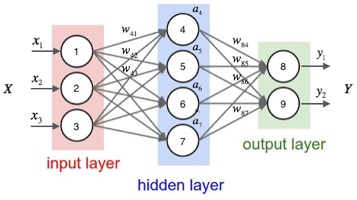

</div>
如上图所示：

-	神经元按照层来布局，最左侧叫输入层（input layer），负责接收输入数据；最右边的层叫输出层（output layer），我们可以从这层获取神经网络的输出数据。输入层和输出层之间的层叫做隐藏层（hidden layer），因为他对外部调用者来说是不可见的。
-	同一层之间的不同神经元没有连接。
-	第N层每个神经元和低N-1 层所有的神经元相连（Full Connected），第N-1 层神经元的输出就是低N层神经元的额输入
-	每一个连接都有一个权值


#### 2.2.2 卷积神经网络&基本原理
**卷积神经网络（Convolutional Neural Network, CNN）**是一种前馈神经网络，它的人工神经元可以响应一部分覆盖范围内的周围单元，对于大型图像处理有出色表现。

卷积神经网络由一个或多个卷积层和顶端的全连通层（对应经典的神经网络）组成，同时也包括关联权重和池化层。这一结构使得卷积神经网络能够利用输入数据的二维结构。与其他深度学习结构相比，卷积神经网络在图像和语音识别方面能够给出更好的结果。这一模型也可以使用反向传播算法进行训练。相比较其他深度、前馈神经网络，卷积神经网络需要考量的参数更少，使之成为一种颇具吸引力的深度学习结构。

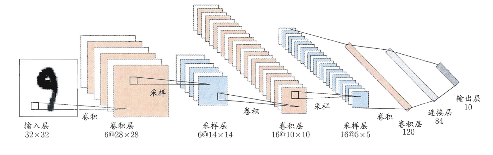

上图以手写字母任务为例

* 网络的输入层是一个31*32的手写数字图像 
* 输出层是其识别结果
* 卷积层和采样层对信号进行处理
* 连接层实现与输出目标的映射

其中每一个卷积层都包含多个特征映射，每个特征映射是一个由多个神经元构成的“平面”,通过卷积滤波器提取输入的一种特征。
采样层又称为池化层，作用是基于局部卷积滤波器原理进行亚采样，在减少数据量的同时保留有用信息。


#### 2.2.3 ResNet50以及迁移学习
分类器的基础架构是ResNet50（Deep Residual NetWorks），这个模型是一个50层的神经网络结构。ResNet50是由Kaiming He 和他的团队发明的，并且一举拿下2015年Imagenet比赛冠军。

深度残差学习（RESNET）模型，在深度学习中，网络的表达能力随着网络深度的增加而增强，但是同时在RESNET之前，随着网络深度的增加训练的复杂度，网络复杂度和误差都在增大。而RESNET中假设深度网络中某隐含层为 $H(x)-x=F(x)$ ， 如果可以假设多个非线性层组合可以近似于一个复杂函数，那么同样也可以假设隐含层的残差近似于某个复杂函数。即我们可以将隐含层表示为 H(x)=F(x)+x。
依据上文假设，我们可以得到全新的残差结构单元。
<div align = center>


</div>

这个网络具有如下特点：

 1. 网络小，参数数量得到控制
 2. 存在明显的层级
 3. 使用较少的池化层，大量使用下采样，提高传播效率
 4. 没有dropout，使用全局平均池化进行正则化，训练速度有保证


**迁移学习(Transfer learning)** 顾名思义就是就是把已学训练好的模型参数迁移到新的模型来帮助新模型训练。考虑到大部分数据或任务是存在相关性的，所以通过迁移学习我们可以将已经学到的模型参数（也可理解为模型学到的知识）通过某种方式来分享给新模型从而加快并优化模型的学习效率不用像大多数网络那样从零学习（starting from scratch，tabula rasa）。比如，已经会下中国象棋，就可以类比着来学习国际象棋；已经会编写Java程序，就可以类比着来学习C#；已经学会英语，就可以类比着来学习法语；等等。世间万事万物皆有共性，如何合理地找寻它们之间的相似性，进而利用这个桥梁来帮助学习新知识，是迁移学习的核心问题。

本项目中使用迁移学习的方法是将冻结除了最后一层全连接层所有网络层的权重。最后一层是一个参数随机初始化的新层，并且只有这一层被训练。
当然也可以冻结ResNet网络中的部分网络，比如前130层，对后面的网络结构重新进行训练获取权重。
所以在本项目中，我可以使用Keras中预训练好的学习到的网络特征运用在猫狗识别的任务中。


### 2.3 基准测试
依据这个项目的考核标准。需要获得kaggle比赛前10%的成绩，在Kaggle的竞赛页面中，截止目前提交成绩人数为1314名。前10%则意味着分数要超过131名，在页面中可以看到第131名的得分为0.06127

基准模型指标得分需要小于0.06127
<br><br><br>
## 3 方法
### 3.1 数据预处理

数据预处理主要有一下的步骤

* 训练集、验证集拆分
* 训练集和验证集的数据都要拆分成两个文件夹 `dog/`和
`cat/`
* 将图片大小resize成244*244
* 标准化，将RGB像素值缩放在0到1的范围内（含0和1）


| 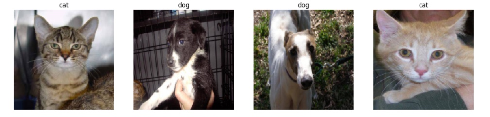|
| :---: |
| 进行了resize之后的图片 |


### 3.2 实施
（已完整记录了使用指定数据集或输入数据实施指标、算法和方法的过程。讨论了编码过程中发生的复杂状况。）

项目实施主要包含以下几个步骤:

* 构建ResNet50神经网络（修改参数，重复此操作）
    * 导入没有top层的神经网络模型
    * 添加全连接层到ResNet50
    * 编译模型
* 训练数据
* 保存最佳模型
* 使用最佳模型进行数据预测

本次猫狗大战的实验使用了Keras进行建模和预测，后端是基于TensorFlow的。Keras是一个高层神经网络API，Keras由纯Python编写而成并基Tensorflow、Theano以及CNTK后端。Keras 为支持快速实验而生，有比较好的特性：

* 简易和快速的原型设计（keras具有高度模块化，极简，和可扩充特性）
* 支持CNN和RNN，或二者的结合
* 无缝CPU和GPU切换

keras.applications.resnet50就是本次实验需要使用的预训练模型。这个没有top层的预训练模型是经过了ImageNet的训练，我们需要在实验之前下载好需要模型文件。使用经过了预处理的从kaggle下载的数据进行了模型的训练

损失函数使用的是交叉熵cross-entropy，并且使用了adadelta,adam,sgd三种优化器对模型进行了训练（具体代码在train_model.py中），并且使用了最佳的模型进行预测。

使用了dropout=0.5来防止模型过拟合。Dropout是指在模型训练时随机让网络某些隐含层节点的权重不工作，不工作的那些节点可以暂时认为不是网络结构的一部分，但是它的权重得保留下来（只是暂时不更新而已），因为下次样本输入时它可能又得工作了。


### 3.3 改进

经过以上方法多次尝试后结果如下（选取部分结果）

| 主要改进参数 | 分数 |
| --- | --- |
|adadelta| 0.06771 |
|adam| 0.06592 |
|sgd| 0.06603 |

经过多次且长时间探索尝试，基于ResNet50神经网络训练出来的最佳模型预测的结果均不能满足`基准模型指标得分需要小于0.06127`的要求。好在在搜索资料时看到了一种方法，通过导出特征向量，使用多个预训练的网络模型，综合各个不同的模型的，从而得到不错的效果。

>[手把手教你如何在Kaggle猫狗大战冲到Top2%--优达学城](https://zhuanlan.zhihu.com/p/25978105)

依据这个思路，实施主要包含以下几个步骤:

* 数据预处理
* 导出特征向量（不需要重复计算）
* 载入特征向量
* 构建模型
* 训练模型
* 预测结果

改进后使用了`ResNet50`,`gap_InceptionV3`,`VGG16`三种预训练模型进行数据预测，并且将数据提供到kaggle处理打分。


## 4 结果
### 4.1 模型评估与验证

使用keras.callbacks.TensorBoard对训练过程记录日志，并且使用Tensorboard对数据进行可视化效果如下
<br>
<br>
#### 优化之前
直接使用resnet50的神经网络中，在epochs=50的情况下训练的情况如下：

| 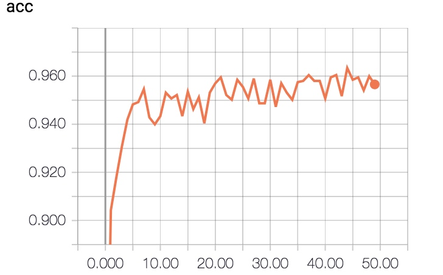 | 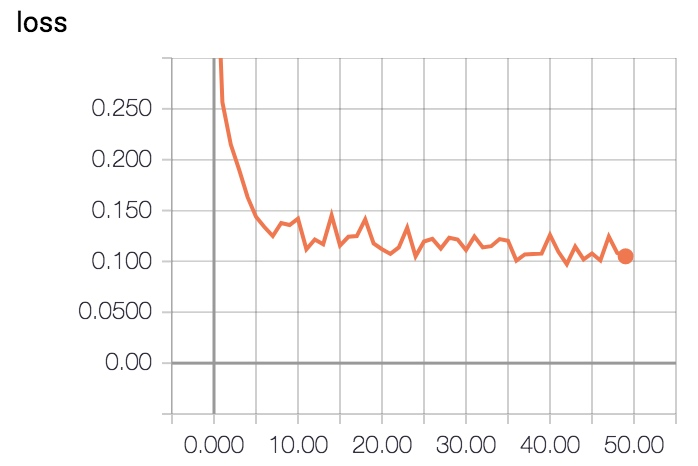|
| :---: | :---: |
| 训练精度 | 训练损失 |
| 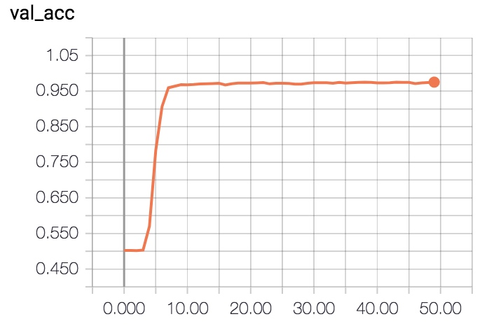 | 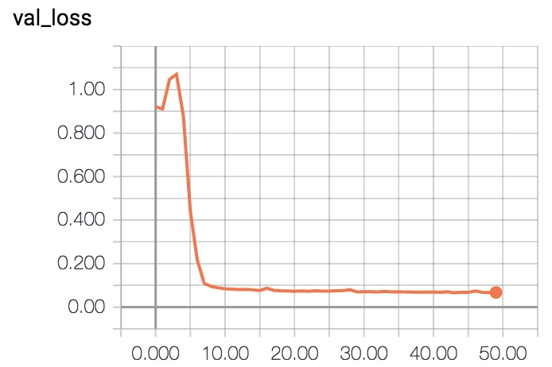 |
| 验证精度 | 验证损失 |

在之前做探索测试的时候，数据的准确率一般在90% 左右。为了让我的结果更加符合要求，我使用了 
经过了40轮以上的训练，验证集准确率大概在0.97左右波动
<br>
#### 优化之之后

| 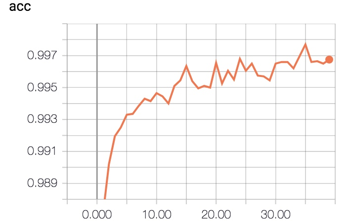 |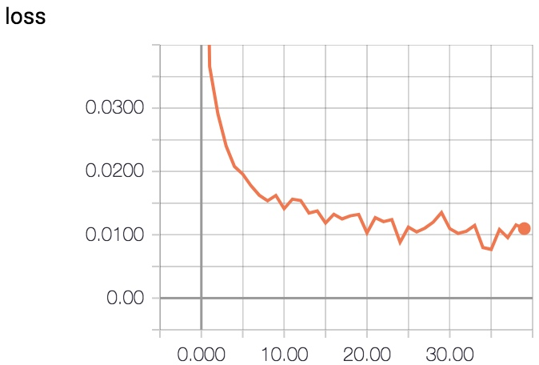  |
| :---: | :---: |
| 训练精度 | 训练损失 |
|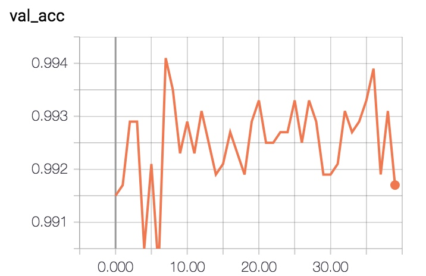|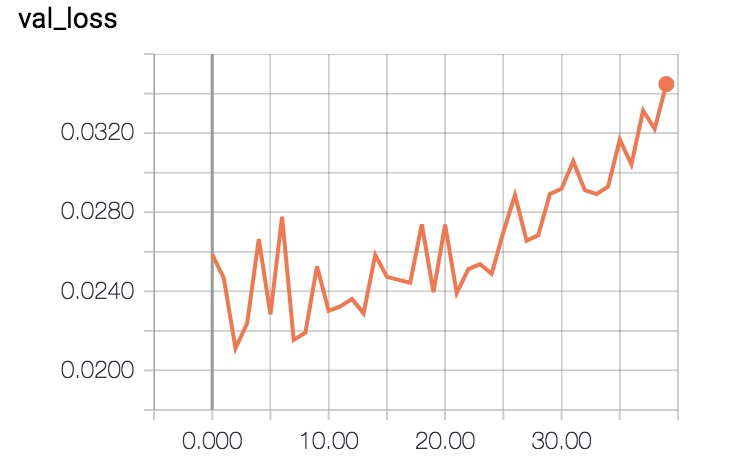|
| 验证精度 | 验证损失 |

从图中可以看到，使用了联合迁移学习模型的方法的精度相比高很多，经过两次训练就能将在验证集上准确率上99%。可以看到在40轮的训练中，训练精度在不断的增加，但是验证的精度波动非常大（看起来大，其实在嘴实际坐标轴里只有不到0.005的波动范围），验证损失在20次之前还是比较稳定，到了20次之后反而有上升的状态。也就是说我们的联合多个模型的迁移学习方法准确性非常好，在导入了特征向量构建模型之后只需要进行很小的训练就能得到很好的效果，比如10次。

最后将文件提交到kaggle里


| 训练次数 | 得分 |
| --- | --- |
| 10 | 0.04661 |
| 40 | 0.05053 |

两个结果都满足了项目要求的kaggle比赛前10%的成绩的得分为0.06127，也证明了联合模型的良好效果，并且在合并模型后不需要进行太多的训练。

```refer
Xception
VGG19
ResNet50
VGG16
InceptionV3
```
其实，我训练了上面的五个模型，其中任意三个组合都能到达非超好的效果。


## 5 结论

下图是用优化之前的Resnet50模型进进行预测的结果展示,可以看到都是正确的结果，只是精度达不到项目的要求。使用了优达学城官方账户在知乎上方法进行了优化知乎，完全能达到项目的要求。

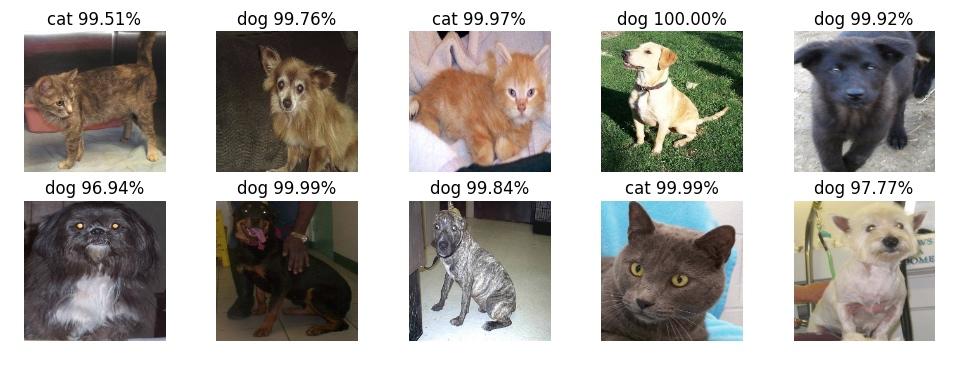

### 5.1 思考
本次实验一开始使用经过Imagenet训练过的神经网络是正确的选择，但是Resnet50层的神经网络可能太弱了，经过多次训练都没有办法达到项目的要求。可能单独使用ResNet101网络来做这个项目的话会很轻松的完成项目。不过最后使用了上的答案提供的方法，训练了多个个模型,任意三个的组合都能很轻松的满足项目的需求,正如知乎上的文章里所说的，兼听则明。不过通过这次实验也了解到，使用迁移学习解决这样类似的图片分类问题是非常明智的选择，Keras非常快的提高了开发和验证探索的可能性。

<br>
## 6 参考文献

[1] B. Zhou, A. Khosla, A. Lapedriza, A. Oliva, and A. Torralba. Learning Deep Features for Discriminative Localization. CVPR'16 (arXiv:1512.04150, 2015).
[2]Kaiming He, Xiangyu Zhang, Shaoqing Ren, Jian Sun.Deep Residual Learning for Image Recognition
[3] Karen Simonyan, Andrew Zisserman. Very Deep Convolutional Networks for Large-Scale Image Recognition
[4]Christian Szegedy, Wei Liu, Yangqing Jia, Pierre Sermanet, Scott Reed, Dragomir Anguelov, Dumitru Erhan, Vincent Vanhoucke, Andrew Rabinovich. Going Deeper with Convolutions
[5] Diederik P. Kingma, Jimmy. Ba.Adam: A Method for Stochastic Optimization
[6] Matthew D. Zeiler. ADADELTA: An Adaptive Learning Rate Method
[7] [手把手教你如何在Kaggle猫狗大战冲到Top2%--优达学城](https://zhuanlan.zhihu.com/p/25978105)
[8] Karl WeissEmail author, Taghi M. Khoshgoftaar and DingDing Wang. A survey of transfer learning


